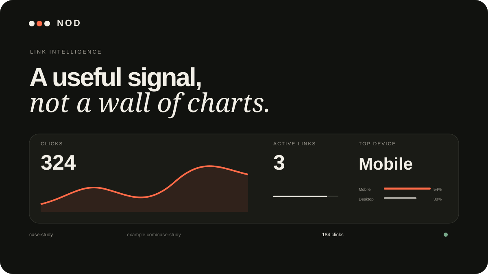

# NOD — Link Studio

**Short links. Long memory.**




NOD is a portfolio-grade URL shortener built as a crafted creative tool rather than a generic SaaS dashboard. The front end is zero-dependency static HTML/CSS/JavaScript and can be published directly from GitHub Pages. An optional Cloudflare Worker + D1 backend turns the portfolio demo into globally shareable short links with privacy-aware click analytics.

## What makes it portfolio-worthy

- Premium responsive light/dark interface with a generative flow field, editorial typography, micro-interactions, command palette, progressive disclosure, and motion-reduction support.
- Real link workflow: URL validation, custom endings, labels, expiry, UTM helper, copy/open/delete, search, JSON export, and persistence across reloads.
- Useful analytics: total clicks, 14-day signal curve, active-link count, device mix, activity pulse, and per-link details.
- Honest local demo mode for GitHub Pages: links persist in `localStorage` and redirect in the same browser via a hash route.
- Real edge mode: Cloudflare Worker creates globally shareable redirects and logs coarse analytics to D1.
- Per-link management keys instead of a public master dashboard credential.
- Optional Cloudflare Turnstile + hashed IP rate limiting for public link creation.
- No raw visitor IP addresses are stored in the analytics database.

## Repository layout

```text
/docs                 GitHub Pages front end
  index.html
  config.js
  styles-loader.js
  styles-*.part
  app-loader.js
  app-*.part
/worker               Optional real redirect + analytics backend
  src/index.js
  migrations/0001_init.sql
  wrangler.jsonc.example
/assets               README preview artwork
RESEARCH.md            Product / architecture research
SECURITY.md            Deployment threat model and safe defaults
README.md
LICENSE
```

The front-end source is loaded from small text chunks so the repository can be written safely through the GitHub connector. The loaders concatenate those chunks in the browser before executing the original tested CSS and JavaScript.

## 1) Publish the portfolio version on GitHub Pages

1. Open **Settings → Pages**.
2. Under **Build and deployment**, choose **Deploy from a branch**.
3. Select `main` and the **`/docs`** folder.
4. Save.

No npm install, framework build, or CI configuration is required.

The default `docs/config.js` keeps NOD in **Local portfolio mode**:

```js
window.__NOD_CONFIG__ = {
  API_BASE_URL: "",
  SHORT_DOMAIN: "nod.link",
  TURNSTILE_SITE_KEY: ""
};
```

Local mode is deliberately honest: generated links work in the same browser because mappings live in local storage. That is ideal for a portfolio demo, but the links are not globally shareable.

## 2) Optional: deploy the real short-link backend

The Worker uses Cloudflare D1 (serverless SQLite semantics) for links, events, and rate-limit counters.

### Create the D1 database

Install or run Wrangler, then from `/worker`:

```bash
npx wrangler d1 create nod-links
```

Copy `wrangler.jsonc.example` to `wrangler.jsonc`, then paste the returned database ID.

Apply the migration:

```bash
npx wrangler d1 execute nod-links --remote --file=./migrations/0001_init.sql
```

Generate a private salt for rate-limit hashing:

```bash
npx wrangler secret put RATE_LIMIT_SALT
```

Deploy:

```bash
npx wrangler deploy
```

Your Worker will receive a URL like:

```text
https://nod-edge.<your-subdomain>.workers.dev
```

### Connect the GitHub Pages UI

Edit `docs/config.js`:

```js
window.__NOD_CONFIG__ = {
  API_BASE_URL: "https://nod-edge.<your-subdomain>.workers.dev",
  SHORT_DOMAIN: "nod-edge.<your-subdomain>.workers.dev",
  TURNSTILE_SITE_KEY: ""
};
```

Also set `APP_ORIGINS` in `worker/wrangler.jsonc` to your GitHub Pages origin:

```text
https://spairkie.github.io
```

### Recommended for a public deployment: Turnstile

Create a Cloudflare Turnstile widget for your Pages domain, then:

```bash
npx wrangler secret put TURNSTILE_SECRET_KEY
```

Add the matching site key to `docs/config.js` as `TURNSTILE_SITE_KEY`. NOD will automatically render a managed challenge in the composer and send the verification token to the Worker.

## Backend security model

NOD is intentionally not pretending to be a multi-tenant SaaS. It is a single-owner portfolio architecture with safe defaults:

- Redirect destinations are stored server-side and limited to `http`/`https` URLs.
- Custom slugs use a narrow character set and a reserved-name list.
- Every link receives a random management secret; only its SHA-256 hash is stored in D1.
- Stats and deletion require the matching management secret.
- Link creation can require Turnstile.
- Creation is rate-limited per hashed client IP; the raw IP is not persisted.
- Analytics store only timestamp, coarse country, device class, and referrer host.
- CORS can be restricted to your GitHub Pages origin.
- An optional `ALLOWED_HOSTS` list can restrict public link creation to destinations you trust.
- Redirect responses use HTTP 302 so destinations remain editable in a future version without browsers over-caching a permanent redirect.

For a public portfolio deployment, read [SECURITY.md](./SECURITY.md) and strongly consider setting `ALLOWED_HOSTS` to domains you control.

## Useful keyboard controls

- `⌘/Ctrl + K` — command palette
- `⌘/Ctrl + Enter` — create a link
- `/` — focus link search when not typing in a field
- `Esc` — close dialogs

## Customize it for your portfolio

The most important edits are in `docs/index.html`, `docs/config.js`, and the front-end bundle parts under `/docs`.

Suggested personalizations:

- Point `SHORT_DOMAIN` at a short custom domain after connecting one to the Worker.
- Replace the sample workspace entries with projects you want to showcase.
- Add a case-study link from your portfolio project card to `RESEARCH.md` or a polished write-up.

## Research

See [RESEARCH.md](./RESEARCH.md) for the competitive scan, product decisions, GitHub Pages constraint, backend choice, privacy/security model, and primary sources that shaped the build.
