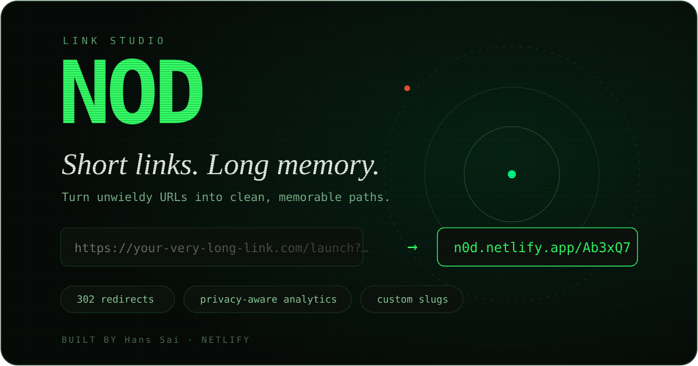
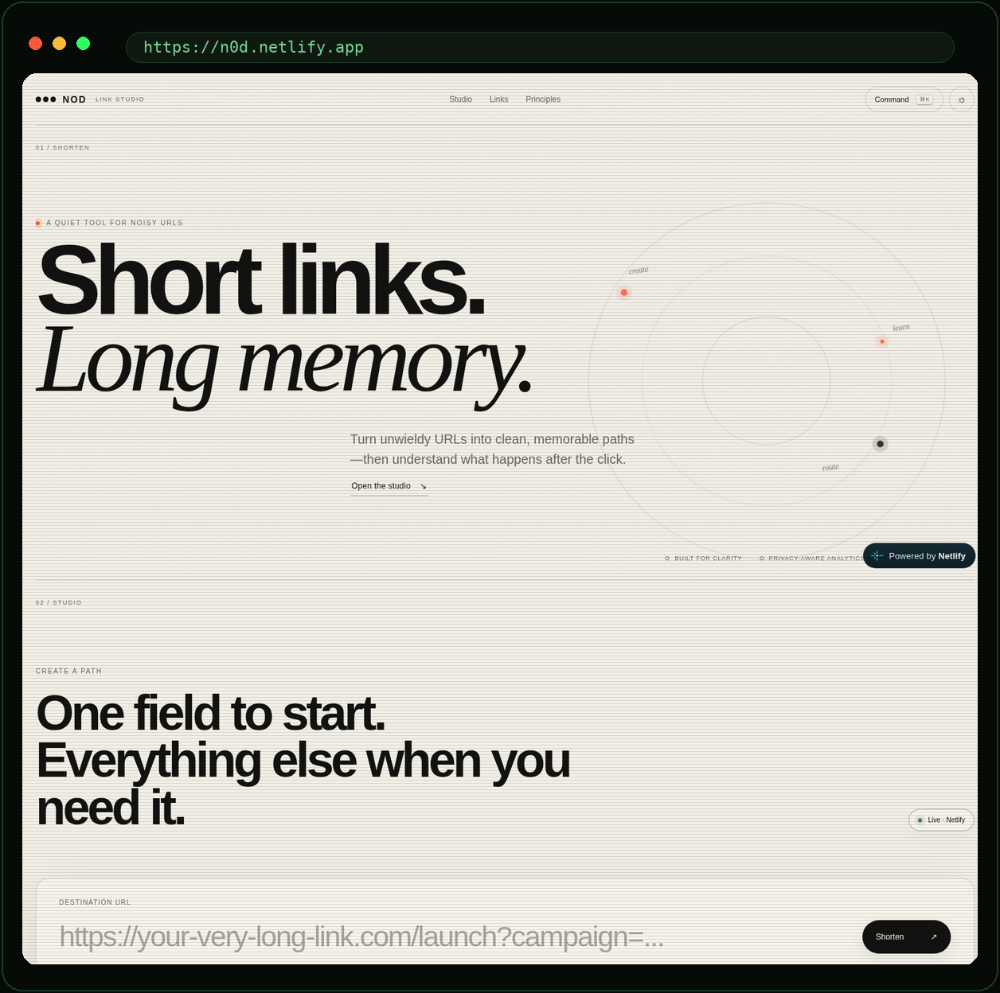
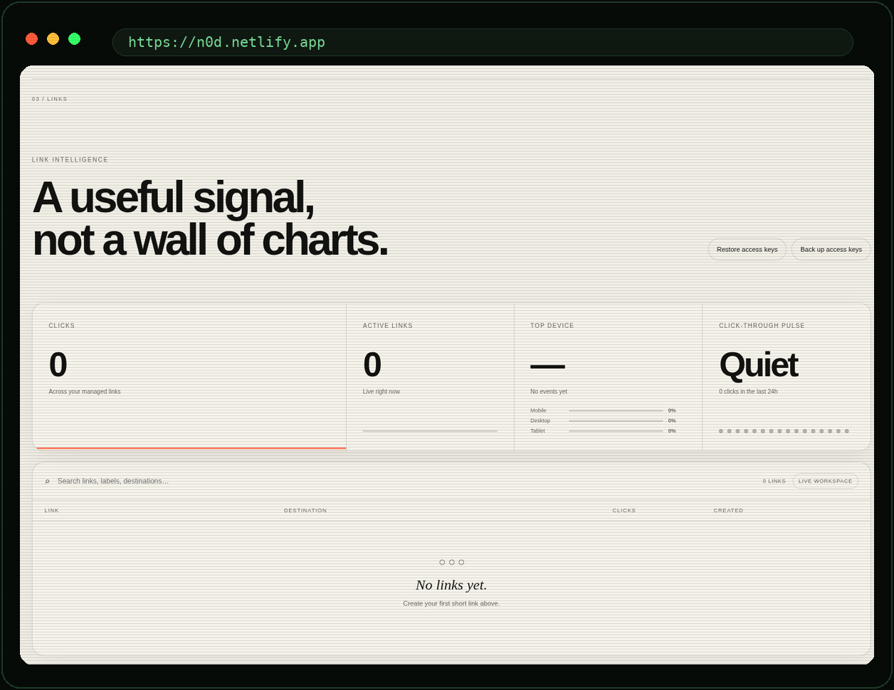

# NOD — Link Studio

**Short links. Long memory.**

<p align="center"></p>

<p align="center"></p>

<p align="center"></p>

NOD is a production URL shortener built as a crafted link studio rather than a generic dashboard. The public app, redirect service, analytics API, and persistent storage run together on Netlify.

**Live:** https://n0d.netlify.app/

## What NOD does

- Creates real, globally shareable short URLs such as `https://n0d.netlify.app/Ab3xQ7`.
- Supports custom endings, labels, expiration, and a minimal UTM helper.
- Returns server-side `302` redirects for short-link requests.
- Tracks coarse click signals including time, device class, country, and referrer host.
- Keeps raw visitor IP addresses out of link analytics.
- Uses private per-link management keys for analytics and deletion.
- Supports access-key backup and restore across browsers.
- Includes search, link details, responsive light/dark themes, keyboard controls, and a command palette.

## Architecture

```text
Browser
  │
  └── Netlify
        ├── /                     NOD studio
        ├── /<slug>               server-side redirect
        ├── /api/*                Netlify Functions
        └── Netlify Blobs
            ├── links
            ├── click events
            └── rate limits
```

The UI and short links intentionally share one hostname. There is no separate demo mode or alternate production backend.

## Netlify deployment

Import `builtbysai/NOD` from GitHub and use:

- **Base directory:** leave blank
- **Build command:** leave blank
- **Publish directory:** `docs`
- **Functions directory:** `netlify/functions`
- **Environment variables:** none required

The root `netlify.toml` contains the production routing and deployment settings, so normal pushes to `main` can deploy automatically through Netlify's Git integration.

## Repository layout

```text
/docs
  index.html
  404.html
  config.js
  styles.css
  ui-polish.css
  ui-runtime.js
  styles-loader.js
  app.js
  app-loader.js
/netlify/functions
  _shared.js
  health.js
  link-create.js
  link-stats.js
  link-delete.js
  redirect.js
/assets
  hero.svg
  studio-screenshot.png
  links-screenshot.png
netlify.toml
package.json
SECURITY.md
README.md
```

## Storage and ownership

Short-link destination records live in Netlify Blobs. Each browser stores the private management keys for the links it manages. Those keys authorize private analytics and deletion; only their hashes are stored with the link record.

Use **Back up access keys** before clearing browser data or switching devices. Use **Restore access keys** on another browser to recover management access for links that still exist in the current Netlify workspace.

## Privacy and abuse controls

NOD accepts only complete external `http://` and `https://` destinations, reserves application route names, rate-limits link creation using a one-way hash of the requesting IP, and does not place the raw IP into click analytics. See [SECURITY.md](./SECURITY.md) for the current threat model and remaining production-hardening work.

## Keyboard controls

- `⌘/Ctrl + K` opens the command palette.
- `⌘/Ctrl + Enter` creates a link.
- `/` focuses link search when you are not typing in a field.
- `Esc` closes an open dialog.

## Development

Install dependencies, then use Netlify's local development environment so Functions and Blobs behave like the production platform:

```bash
npm install
npx netlify dev
```

NOD intentionally stays framework-light: the studio is static HTML, CSS, and JavaScript, while server behavior lives in small Netlify Functions.
